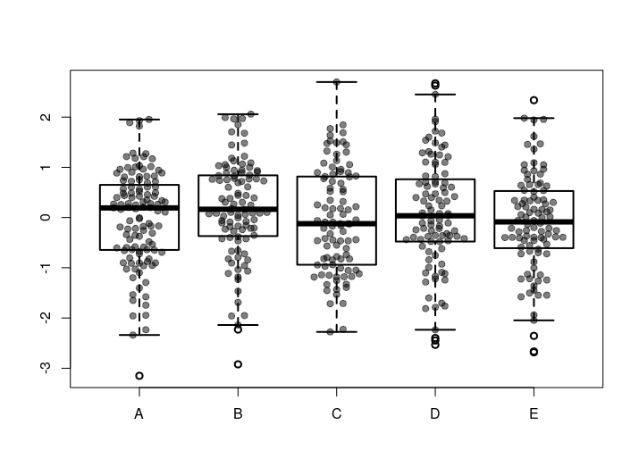

# spreadPoints
## Author: Joseph Crispell
## Repository created: 05-02-19
## Licence: GPL-3
A function to add points onto boxplot that are deterministically spread out to minimise overlap

Package can be directly installed into R using:
```
install.packages("devtools")
library("devtools")
install_github("JosephCrispell/spreadPoints")
library(spreadPoints)
```

Once installed test it out with the following code:
```
# Set the seed
set.seed(254534)

# Generate some example points - drawn from exponential distribution
values <- rexp(n=50, rate=2)
 
# Plot a boxplot
boxplot(values, xlab="",  ylab="", frame=FALSE, las=1, pch=19, outcol=rgb(1,0,0, 0.5),
        horizontal=FALSE)
        
# Plot the points spread along the X axis
spreadPoints(values, position=1)
```


If you've plotted multiple boxplots, you can call `spreadPoints()` multiple times or you can use the `spreadPointsMultiple()` function:
```
# Set the seed
set.seed(254534)

# Generate some example points - drawn from normal distribution and randomly assign them to categories
randomSamples <- data.frame(Values = rnorm(500), Category = sample(c('A', 'B', 'C', 'D', 'E'), size=500, replace=TRUE))
 
# Plot a boxplot of the samples from the normal distribution versus there categories - multiple boxplots
boxplot(Values ~ Category, data = randomSamples, lwd = 2)
 
# Plot the points for each category spread along the X axis
spreadPointsMultiple(data=randomSamples, responseColumn="Values", categoriesColumn="Category")
```

